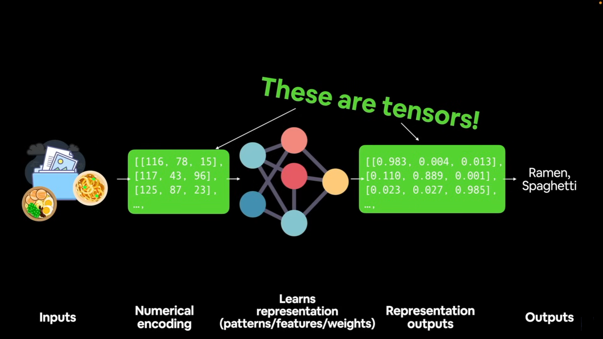

# Machine Learning vs Deep Learning

## Machine Learning

Machine learning involves the application of traditional algorithms to structured data. In this paradigm, data is typically organized and follows a clear pattern. Some key points about machine learning include:

- **Structured Data Usage:** In machine learning, the focus is on utilizing traditional algorithms that are well-suited for structured data. This type of data has a defined and organized format, making it suitable for algorithms that can extract patterns and make predictions.

- **XGBoost Algorithm:** One of the standout algorithms in machine learning is XGBoost. It is an ensemble learning method that is widely used for regression and classification tasks. XGBoost is particularly effective in handling structured data and has been successful in various machine learning competitions.

## Deep Learning

Deep learning, on the other hand, is a subfield of machine learning that excels in handling unstructured data. Unstructured data lacks a predefined pattern and may include diverse sources like images, text, and audio. Here are some key points about deep learning:

- **Unstructured Data Focus:** Deep learning is particularly well-suited for unstructured data, where traditional machine learning algorithms may struggle. Examples of unstructured data include images, web-scraped content, tweets, and sound files.

- **Neural Networks:** In deep learning, a common approach is the use of neural networks. These are computational models inspired by the human brain, consisting of layers of interconnected nodes. Neural networks can automatically learn to extract features and patterns from unstructured data.

- **Versatility:** Deep learning techniques, such as convolutional neural networks (CNNs), recurrent neural networks (RNNs), and transformers, offer versatility in handling different types of unstructured data. For instance, CNNs excel in image recognition, RNNs in sequence data, and transformers in natural language processing tasks.

Understanding the distinction between machine learning and deep learning is crucial in selecting the right approach for a given problem based on the nature of the data.

# Algorithms

| Structured Data                  | Unstructured Data                   |
| ---------------------------------| -----------------------------------|
| Random Forest                    | Neural Network                      |
| Gradient Boosted Models           | Fully Connected Neural Network      |
| Naive Bayes                       | Convolutional Neural Network        |
| Nearest Neighbors                 | Recurrent Neural Network            |
| Support Vector Machines           | Transformers (my favorite)          |

# PyTorch

## What is PyTorch?

PyTorch is one of the most popular deep learning frameworks, widely recognized for its prominence in research. It is designed to facilitate the development of fast and efficient deep learning code in Python, with accelerated performance through GPUs.

## Key Features

- **Fast Deep Learning Code:** PyTorch allows developers to write high-performance deep learning code in Python, leveraging the computational power of GPUs for accelerated training.

- **Access to Prebuilt Models:** PyTorch provides convenient access to a variety of prebuilt deep learning models through Torch Hub and `torchvision.models`. This feature enables practitioners to easily use and experiment with established architectures.

- **End-to-End Stack:** PyTorch offers a comprehensive deep learning stack, covering the entire workflow from data preprocessing to model deployment. This makes it a versatile choice for building and deploying machine learning models in various applications and cloud environments.

## Origin and Adoption

- **Facebook/Meta's In-House Framework:** Originally designed and used in-house by Facebook (now Meta), PyTorch was initially not open-sourced. However, recognizing its value, the framework was later released to the public.

- **Wide Industry Adoption:** PyTorch has gained widespread adoption across industries and is used by prominent companies, including Tesla, Microsoft, and OpenAI. Its flexibility, ease of use, and strong community support contribute to its popularity in both research and production settings.

# Tensor

## What is a Tensor?

In simple terms, a tensor is a multidimensional array. Tensors can take various forms:

- **Scalar:**
- **Vector:**
- **Matrix:** 

Tensors are versatile and can represent numerical encodings of diverse data types, such as images, videos, sounds, or text. Additionally, the output of a neural network is often in the form of a tensor, emphasizing their role as multidimensional arrays.

### Visual Representation

